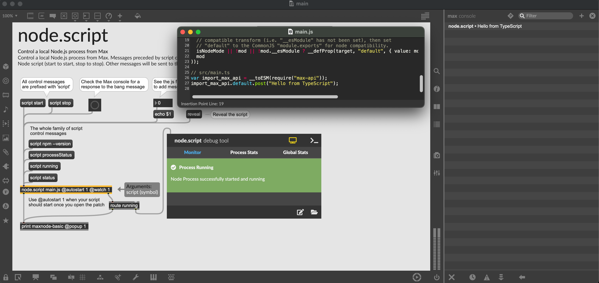

# How to setup a Node for Max project with TypeScript



In this blog post I'll show you how to setup a Node 4 Max project with TypeScript. The project will live in a Git repository for versioning and will feature `build` and `watch` scripts for hot reloading.

## TLDR;

If the explanation is too long for you, you can just clone the repository and start from there.

```bash
npx degit 
```

## Requirements

### Install Max MSP

Make sure you have the latest version of Max MSP installed.
At the time of writing, the latest version is 8.6.0, which contains a local instance of NodeJS 20.6 ([Release Notes](https://cycling74.com/releases/max/8.6.0))

To download Max MSP go to [https://cycling74.com/downloads](https://cycling74.com/downloads)

### Install NodeJS

Even though Max MSP bundles NodeJS internally, you still need to run node on your terminal to setup the project. I recommend [installing NVM](https://github.com/nvm-sh/nvm?tab=readme-ov-file#installing-and-updating) to manage your node versions.
Once you have NVM installed, run the following command to install the version we need.

```bash
nvm install 20.6
```

## Create Max Project

To simplify the management of multiple patchers and assets, Max MSP introduces projects. A project can be created by opening the Max MSP app and go to _File > New Project_.

Now you should see a floating panel for your project.
Click on the plus icon on the bottom and create a new pather file called `main.maxpat`;

Once you have created the patcher, your project folder should look similar to this:

```
.
├── n4m-typescript.maxproj
└── patchers
    └── main.maxpat
```

## Setup Node environment

Since this is going to be a Node project, we need to create a `package.json` file, where our scripts and dependencies will be configured.

### Check node version

First, check if your are running the correct Node version:

```bash
node -v
```

The command should print out `v20.6.1`.
If see a different version and you have installed NVM, you can switch to the right version with:

```bash
nvm use 20.6
```

### Create package.json

To create the file, you can run this command inside the project directory.

```bash
npm init -y
```

Now you should have a package.json file that looks like this:

```bash
{
  "name": "n4m-typescript",
  "version": "1.0.0",
  "description": "",
  "main": "index.js",
  "scripts": {
    "test": "echo \"Error: no test specified\" && exit 1"
  },
  "keywords": [],
  "author": "",
  "license": "ISC"
}
```

### Set engine version

We want to make sure that the project is running the correct Node version. To do so, we can add an `engines` property to the `package.json` file. 

```diff
+  "engines": {
+     "node": ">=20.6"
+  },
```

This config makes node and npm throw an error if the node version is not compatible with the one specified.

### Setup TypeScript

To make TypeScript work with Node and Max we need to install some dev dependencies:

- `typescript` is the compiler for TypeScript
- `@tsconfig/recommended` contains the recommended TypeScript configuration
- `@types/node` contains the type definitions for Node
- `@types/max-api` contains the type definitions for Max API bindings

Run this command to install the dependencies:

```bash
npm i --save-dev typescript @types/node @tsconfig/recommended @types/max-api
```

After the installation, you should see a new `node_modules` folder and a `package-lock.json` file.

- `node_modules`: folder that contains all the dependencies
- `package-lock.json`: file that contains the exact version of the dependencies installed

Additionally, the dependencies will be added to the `package.json` file like this:

```diff
+  "devDependencies": {
+    "@tsconfig/recommended": "^1.0.3",
+    "@types/max-api": "^2.0.3",
+    "@types/node": "^20.11.15",
+    "typescript": "^5.3.3"
+  }
```

Now, let's create a simple `tsconfig.json` for our project.

```json
{
  "extends": "@tsconfig/recommended/tsconfig.json",
  "compilerOptions": {
    "noEmit": true,
    "module": "ES2015",
    "moduleResolution": "Bundler"
  },
  "include": ["src/**/*"]
}
```

Since we have specified `noEmit`, TypeScript will perform type checking without generating any JavaScript files.
To transform TypeScript into JavaScript we need to use a bundler. In this case we are going to use [ESBuild](https://esbuild.github.io/) because is fast and easy to configure.

Bundling is necessary because Max MSP doesn't support ES Modules very well. ESBuild will concatenate all the JavaScript modules that we need into a single file that we can load in Max.

### Setup Bundling

To install ESBuild, run this command:

```bash
npm i --save-dev esbuild
```

Now let's create our application entry point inside `src/main.ts`:

```typescript
import { MaxAPI } from "max-api";

// It will post a message in the Max console
// when the script is run by the `node.script` object
maxAPI.post("Hello from TypeScript!");
```

To bundle the application, we need to create a `build` script in the `package.json` file:

```diff
   "scripts": {
-    "test": "echo \"Error: no test specified\" && exit 1"
+    "build": "esbuild src/main.ts --bundle --platform=node --external:max-api --target=node20 --outfile=dist/main.js"
   },
```

You might have noticed a few flags in the command:

- `--bundle`: tells ESBuild to bundle all the dependencies into a single file
- `--platform=node`: tells ESBuild that the target platform is Node
- `--external:max-api`: tells ESBuild to not bundle the `max-api` dependency
- `--target=node20`: tells ESBuild to target Node 20
- `--outfile=dist/main.js`: tells ESBuild to output the bundled file in the `dist` folder

Now, if you run `npm run build` you should see a `dist` folder with a `main.js` file inside.
To make it available inside our patcher, we need to open the Max Project window and click on the `+` icon on the bottom. Select _Add Existing Files_ and select the `dist/main.js`.

## Connecting Max to the application

The last piece of the puzzle is to connect the patcher to the application.
To do so, I recommend copy and modify the helper patch for `node.script` and modify it to fit our needs.

The node object should look like this, everything else is optional:

```
node.scripts main.js @autostart 1 @watch 1
```

- `node.script`: name of the max object
- `main.js`: filename of the bundled application
- `@autostart 1`: tells the object to start the application when the patcher is loaded
- `@watch 1`: tells the object to reload the application when the `main.js` is modified

Here is a compressed version of the patch that you can copy and paste inside `main.maxpat`:

```
<pre><code>
----------begin_max5_patcher----------
2632.3ocuasziiiaD9r6eEDBYvdoaOjTumbYFjbIAYytHytHG1YggrEsM6QV
TPjtc2Yw9eO7gjrjrjaYaIO.s8HRIyu5iUUrXUT+wCyrVxdkvs.eB7afYy9i
GlMS2jpgYEWOyZWzqqRh35ayZEa2NRpv5QSeBxqBc6+Jm.9bzdAiKhxE.D3v
VRJ3M19b.eUNMS.3aY6ShAl9YoqHpdArL4sI1R.YQhUaK+YSnojUr8o5eabQ
izX8HwV97SHT4clteGMMgHznCcrQ1dQYqvhV0i.McyhbxJgQlsClCeD33DN2
8Q.F5q9x1dND76pG4Oe3A0GONPpIkbPhsSXlbITHf78ooxwtrWC7DukQL.wx
5Q4efeuCQsSIE2ojh6WRwtPsn54n9xOT8IFekRZeJA.v+hl9c9mJ6X4lUrDV
tAAv41vv.ncHF45E3g8eT0Dx2ywG5FDfscwgO10cgTn7ThwAWNLqYoBN8+oo
RjR9NBqZiORIxM9n5W81Th7jZLR8FjlfQgNZcoqkZEQK6UGgpn71pJxGnv.1
5mT1R+yuB9xO+O.+c1Jt5F0s8uYwDvZVN3GidE7SuPxegRNn5U0wb4S7eIK4
TAQ2zO+iUW1o9nuUEUjGsiHH4KHoQKSH0ook6EBVZK5783X6ihTC8FmPHJzC
5G3Xir8seT2TccDWUStsUkpOC24zFVMgY6Xl17zeAQiqwel1AWrdxvz0VZbL
oAyTib8sFIMRsnIIKswN5nwd8mgjWHOEBjzPhlPjZGbZiotYVQYY0ZdVsGQw
BOaloBdrpIZpoIuplxIuPKedXUqQ4RjKjvdetV6w5UOGqi+LRky7z8TMTLMJ
mOJfjl4Sk5e7rnUlGVMAU18Qt.AMbAzV8kmiwMX.7Han7SkvV8cRbczYol3n
oY4DtzUWjnE3shIqi1mHVzv4Cddm8ut.hc1oRHz3+K4znjJIXSNMlkp.QioB
UykCmT3b0xlacgQeGoQYc7vRULIuzSmxElE64KixUyTEly3xNELVRytpdtDx
ZQQ2YzzzVrnfk0em4zMaOyytjI6b249s08vWrO0z6BoRgXAO5klrsHJIov9r
4O+qQozcQBhfZlBvvpNMtz1JicgkjzPdM87RG8DKUxWQNPiEa0CTckASPPEJ
QVUyxwzMDtnYahnM7lsvEuYH8ZMseYgQ7BAYWVRjn0MHMOnbgLnqC7harTQq
NAbL3u5F00c10n8VN8jVe7nMjJS15d9jSrY7O8wOlJshelOmku4ijzOV+VOM
FnJk3VtEcq+XcEGTGtGQ05oqH+PZuhgX8R2XTy3glUt.PgSmIjeNb3v7zrcR
JRFU0UxONiO+33YWiercmD9owhlsV3bkz0nzB65HD+dIDz0RHgtFlPu9g68W
eIgEEC9lUmgxMW9qHg72rtN1xd7UeLrkQ6AqiI+tp8X1yETtMTLv97jxis9q
ORB2KI41KI4ddRRGclqItDr+jvQZTdVBPsoh9jYTuxL7ZULLQjpC7FV9Yigu
buk0WLSCqzXxq0BEbxUgHaHulA9l7ebvmkK2xETgRq5Ce.CGGUp.zU3lZH5T
XOyVb87t2FdRu1RmS6j.aKHUFz7KDvRFS7t704zBsctBZBODZB5X7oGduoId
VtThWC3uovLPsuKYn.ef+QsV97shcW4BeXuwekOCWYizbUf+cekuTmcOEkQe
p1tnuTVYBBfz+X3QAn6s9SzRNKQ5LRYmccTBxYhTTP9ZNwO7tqm7W+Vt7dAI
Q6SWscYtbiOjbveogO1txq7kRbvIRWxF4a1Khl4rc6g4NtQekvzy12zigp+t
oTNae9pRIsXgdPykgk6XUPSqR6wuUEDDXnSnWLFbFHHrO8F2QiyXROpEzAxS
yjE4z63ESDxwCk8bmP5SABzPXuIFC1C.CNSLFvC.CS5bg6.0HPCUUtHQeGuX
pPt2.Qd.ZXHG6VyHTewDgb6ABb+Ibd2dntv5fl6l8LKFT6hIB4CE3pU+NOvc
Lq+aax2tA45KlHj6NZH2FCuqHO.MZPuPAIntsVfWuQP7P8ZoXoxWd7BSsAVD
ID4zkxPK4sKNzEkC6MIrkQIsR7bWo39gifajJB8+g7BIJQelBL.15z5r4VUg
58KaVOiarxaNgAFS0BO0lcK4bkEUrYzt0yMgRD6+rDzUcasufyQ.5LBXwYkv
HfNna5bDTVBiRnoxkotDSzDp3s5HgsdMmHJKHLTUu2iUyzT7t3boRUUQYJmi
VkPW8cw1b19Maq29I02oYGubZGlQor1aUE5dipLkMZgkGaJsJruInkQoa5bR
xqZRpzjQt4246XoTAKuHKuWPIhOy7ncnYdLPu.iCDZlHgi7IB4WjVgG1xRHf
0Q6nIuAXqKOOPEI3GTnjyG5Y+wYjJRtiNgFXOSNfLGOlq9r+zmkZgr9tm9mN
OfKnQxjUKn1d5uBruIK12QNSy1Ad5oxyJvk4eJbTkVn4L4ztzCiq3lkyVIui
upqb9EJttip3ZapSGJbJEW90Hm1ipbFp+x2cZESV1kIj3fwQHCMQdFpSDjm6
jbF89JgniM5YtNsy5ZIRSWy.rTvV1AffAhhiK8JC1FkFmHsmGp24pDPWDZkN
JUyog.cYwbYtMNMlzOWdti1omNZdji43+3oOomtWKaJG1kGiSoyRXz6h5UYe
9rmXtArXF9bRqYYLipiKbRrOHq1xNlP0gZaLRN.Jjvh.OcsmDii+1VxpuqMO
TkWWFgBmUXhDAxI7LYCDkEh5NTy2fVT06Zcf505.eWsNJxReo0Q.7lrNJNsm
Wb3tnvQxx3L5MpD+dzxv19lByquS4opZd.4cpNrSOsLhSWA9bFKaeF.0wtOQ
tiSDr3hyhRfotK9ShIwWRRNITcPTNQF7CYM8URL3.UrE7ClEO+gAeB9crtqJ
7FtpTe291VM38iSJWbYdIQ3wwKYgXVDAg2MoQzixtRGedgjtKhlNWFIQi27i
OePgK.5JdWGfVW9pgsOh+v49NHjum5+YN13u6QA2vZNXyhJFkiFmW5AlhrJV
n0wBcci7ALSSgKVRSWnqeaiLiI2AUO8nY0iG.lqJmYOy2SGfh4oovniCBkEc
SJSxgpDrzTq7Bck+LOJeydkymxWjgZpXppZAa7lZzggfJP1pLlrkjjESDQzD
tT0z5LqLXrULNQMao.gt1UFFCl049yrWJwJ+8dGVE6aLlJpXkbC3XnqKxFBg
NAA3.jZWbsHYMJZVOaCm2Nk5EL+o0NFVu5m8kF8iU94jI2KZffu2.4NFiDdH
iDbLFovKXjJtoV0e.CMK0X6OW8x3fM4VTe0MBNr8MCNaeSRfbCqCN8U2J3Bt
Yvod8TJ3pFD2sBsam1bbMISxyrYRCx75OAwCFY2NzLG+5BWLFj4brn3WOxbG
IjY6VCY5KtUjENVHCGTCYpKtQj4fFKjETmyBtcNCc27TOf0d7NqCJjQE1bdk
rCMKf13JrwGlCLr5paE09CfeZdO0d0EuM2lCwNCaexTiILgVuLhpAo0KgXqW
.wSe4C6+EOr8KcntH488xF9ve9v+GaJmA+.
-----------end_max5_patcher-----------
</code></pre>
```